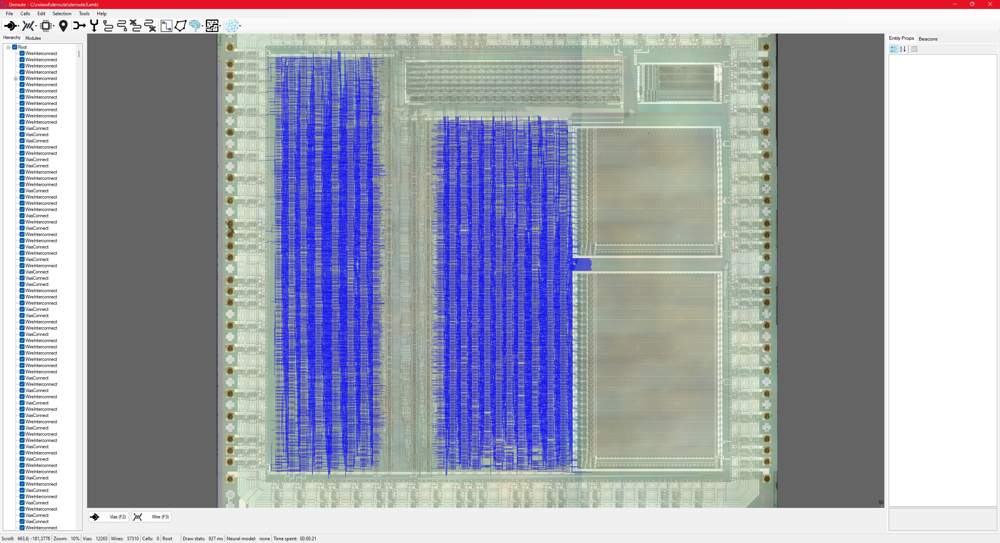
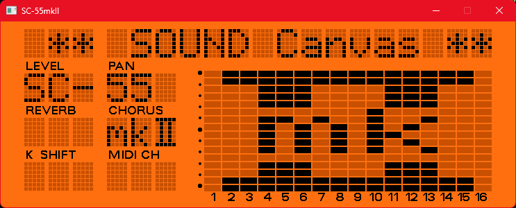
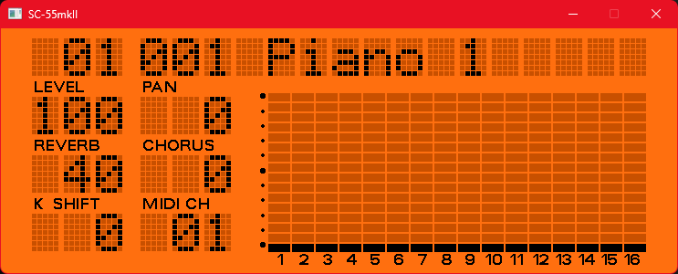

# Nuked SC-55
Roland SC-55mkII emulator, by nukeykt.

Special thanks:
- John McMaster: SC-55 PCM chip decap.
- org/ogamespec: deroute tool.
- SDL team.
- Wohlstand: linux/macos port.
- mattw

## Status

3 ICs are needed to be emulated:
- Roland PCM chip
- Hitachi H8/532 MCU
- Mitsubishi M37450M2 MCU

MCUs are emulated using info from their datasheets. PCM chip info is derived from analyzing decapped chip.

### PCM chip tracing progress



### MCU emulation progress






## Install

Put SC-55mkII firmware image into the same folder as Nuked SC-55. Files should be names as such:
```
R15199858 (H8/532 mcu) -> rom1.bin
R00233567 (H8/532 extra code) -> rom2.bin
R15199880 (M37450M2 mcu) -> rom_sm.bin
R15209359 (WAVE 16M) -> waverom1.bin
R15279813 (WAVE 8M) -> waverom2.bin
```

## Additional info

- Nuked SC-55 will listen to the default MIDI IN port. To use it with the other applications use external MIDI pipe software (e.g. loopMIDI).

- SC-55mkII buttons are mapped as such (currently hardcoded):

```
Q -> POWER
W -> INST ALL
E -> INST MUTE
R -> PART L
T -> PART R
Y -> INST L
U -> INST R
I -> KEY SHIFT L
O -> KEY SHIFT R
P -> LEVEL L
LEFTBRACKET  -> LEVEL R
A -> MIDI CH L
S -> MIDI CH R
D -> PAN L
F -> PAN R
G -> REVERB L
H -> REVERB R
J -> CHORUS L
K -> CHORUS R
LEFT -> PART L
RIGHT -> PART R
```

- Due to a bug in the SC-55mkII's firmware, some parameters don't reset properly on startup. Do GM, GS or MT-32 reset using buttons to fix this issue.
